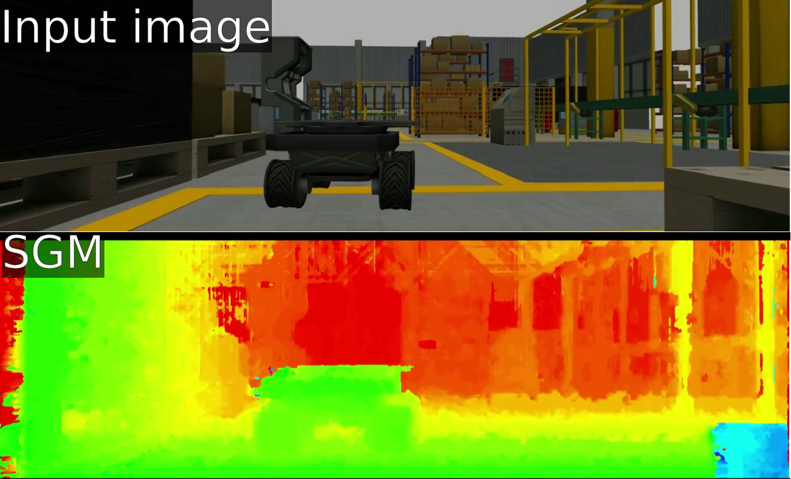

# A ROS wrapper of Semi-Global Matching on the GPU

`sgm_gpu_ros_wrapper` is a ROS package which contains a nodelet using [Semi-Global Matching on the GPU by D. Hernandez-Juarez](https://github.com/dhernandez0/sgm) .

The nodelet just wraps [SGM on GPU](https://github.com/dhernandez0/sgm) so please check specification and limitation of it.

Visualized result using 8 path directions:



## Prerequisite

- [ROS Melodic Morenia](http://wiki.ros.org/melodic)
- [CUDA Toolkit](https://developer.nvidia.com/cuda-toolkit)

## Build

```
$ cd <YourCatkinWorkspace>/src
$ git clone https://aisl-serv6.aisl.cs.tut.ac.jp:20443/fujimoto/sgm_gpu_ros_wrapper.git
$ cd sgm_gpu_ros_wrapper
$ git submodule init
$ git submodule update
$ cd ../../
$ catkin_make
```

## Run 

```
$ rosrun nodelet nodelet standalone sgm_gpu_ros_wrapper/sgm_gpu_nodelet left_image:=<YourLeftImageTopic> right_image:=<YourRightImageTopic>
```

You can see result by [disparity_visualize](https://github.com/ActiveIntelligentSystemsLab/disparity_visualize) .

## sgm_gpu_ros_wrapper/sgm_gpu_nodelet

A nodelet calculate disparity from stereo image topic.

### Subscribed topics

- `left_image` ([sensor_msgs/Image](http://docs.ros.org/api/sensor_msgs/html/msg/Image.html))
  
  Rectified image topic from left camera.
  Should be remapped.

- `right_image` ([sensor_msgs/Image](http://docs.ros.org/api/sensor_msgs/html/msg/Image.html))

  Rectified image topic from right camera. Should be remapped.

- `<base topic of left_image>/camera_info` ([sensor_msgs/CameraInfo](http://docs.ros.org/api/sensor_msgs/html/msg/CameraInfo.html))

  Subscribed automatically based on topic of left_image.

- `<base topic of right_image>/camera_info` ([sensor_msgs/CameraInfo](http://docs.ros.org/api/sensor_msgs/html/msg/CameraInfo.html))

  Subscribed automatically based on topic of right_image.

### Published topic

- `~disparity` ([stereo_msgs/DisparityImage](http://docs.ros.org/api/stereo_msgs/html/msg/DisparityImage.html))

  Disparity image computed by SGM

### Parameters

- `~p1` (int)

  Parameter used in SGM algorithm.
  See [SGM on GPU papar](https://www.sciencedirect.com/science/article/pii/S1877050916306561) and [SGM paper](https://ieeexplore.ieee.org/document/4359315) .

  Default value is `6` from [SGM on GPU](https://github.com/dhernandez0/sgm) .

- `~p2` (int) 

  Parameter used in SGM algorithm.
  See [SGM on GPU papar](https://www.sciencedirect.com/science/article/pii/S1877050916306561) and [SGM paper](https://ieeexplore.ieee.org/document/4359315) .

  Default value is `96` from [SGM on GPU](https://github.com/dhernandez0/sgm) .

### Limitations

See [GitHub page of SGM on GPU](https://github.com/dhernandez0/sgm) .

### How to change number of path direction

Change [PATH_AGGREGATION in sgm/configuration.h](https://github.com/dhernandez0/sgm/blob/master/configuration.h#L29) and rebuild.
Available value is `4` or `8` .
